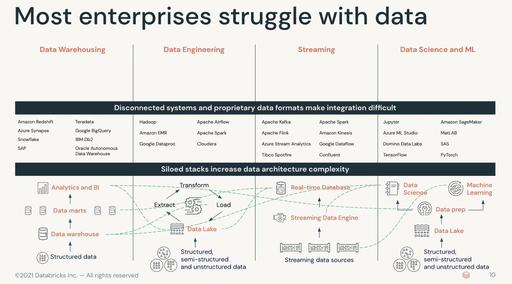

# Data Engineering with Databricks

- Comprehensive introduction to the components of the Databricks Lakehouse Platform that directly support putting ETL pipelines into production. 
  - Leverage SQL and Python to define and schedule pipelines that incrementally process new data from a variety of data sources
  - Power analytic applications and dashboards in the Lakehouse. This course offers hands-on instruction in 
  - Databricks Data Science & Engineering Workspace
  - Databricks SQL
  - Delta Live Tables
  - Databricks Repos
  - Databricks Task Orchestration
  - Unity Catalog

## Databricks Lakehouse Platform

- Simple platform to unify all of your data, analytics, AI workloads
- Challenges
  - Architecture
  - Data warehouseing
  - Data Engineering
  - Streaming
  - Data Science and ML
  - Multiple, siloed stacks increating data architecture complexity
  - Many different copies of data and no overarching governance

- Data Lake
- Data Warehouse
- Combine as Lakehouse
  - Robust, secure, scalable systems
- Delta Lake
  - Build curated data lakes
  - Governance
  - ACID transactions
  - Governance at scale
  - Fine-grained access control
- Lakehouse advantages
  - Simple - one copy of data
  - Open Source
    - Spark
    - Delta Lake
    - mlflow
    - Koalas
    - redash
    - No vendor lock-in on data
    - Over 450 partners
    - Ingest / use
    - Integrated through databricks
  - Collaborative
    - Engineers
    - Analysts
    - Data Scientists
    - All collaborate together
    - Models
    - Dashboards
    - Notebooks
    - Datasets
  - Data can remain in data lake rather than being copied into four environments

## Databricks Architecture and Services

- Control Plane
  - Back end services
  - Manage customer accounts, datasets, and clusters
  - Databricks Web Applications
  - Repos / Notebooks
  - Jobs
  - Cluster Management
- Databricks Cloud Accounts
- Customer Cloud Account
- Data Plane
  - Data processing with Apache Spark CLusters
  - Data Sources
  - Databricks File System (DBFS)

### Clusters

- Run DS workloads
- Commands in notebook or job
- ETL
- Streaming Analytics
- Ad-hoc analytics
- ML
- Made up of one or more virtual machine instances
- Workloads distributed by SPARK
- One Driver and multiple worker nodes
- Types
  - All-pourpose Clusters
    - Analyze collaboratively in a notebook
    - Create from workspace or API
  - Job Clusters
    - Run automated jobs
    - Start and stop automatically in isolated execution environment

### Data Science and Engineering Workspace

- Create notebook
- Import Data
- View Documentation
- Workspaces
  - DS/ Engineering
  - Machine Learning
  - SQL
  - Pin personas to make defaults
- Create
  - Notebook
  - Clusters
  - Jobs
  - Repos
- Recents
  - Quick access to recently used assets
- Data
  - Browse assets in workspace
  - DBFS
  - Tables
- Compute
  - Clusters page
  - Create and manage
- Jobs
  - Create and manage jobs and pipelines
- Partner connect
  - Partner integrations
- Help
  - Release notes
  - Documentation
  - Community
- Settings
  - GIT integration
  - Keys

### Create and manage clusters

- Set of computation resources and configurations
- Data engineering, data science, and data engineering
- ETL pipelines, streaming analytics, ad-hoc analytics,machine learning
- Create Clusters
  - Policies may impact options for configuration
  - Compute - create a cluster
  - Name - descriptive
  - Single node option
  - Default options

### Notebook Basics

- Primary means of developing and executing code interactively on databricks
- Attach notebook to a cluster
- Run a cell: Control enter
- Run and move to next cell: shift + enter
- Set default language: python, SQL, Scala, R
- B on keyboard creates a cell below
- Magic commands `%sql` / `%python` / `%md`
  - These are built-in commands that provide the same outcome regardless of the notebook's language
  - A single percent (%) symbol at the start of a cell identifies a magic command
    - You can only have one magic command per cell
    - A magic command must be the first thing in a cell

---

## Delta Lake

> Open-source project that enables building a data lakehouse on top of an existing storage system

- Delta Lake is **NOT**:
  - Proprietary technology
  - Storage format
  - Storage medium
  - Database service
  - Data Warehouse
- IS:
  - [Open Source](http://delta.io)
  - Builds upon standard data formats
  - Optimized for cloud object storage
  - Built for scalable metadata handling

### ACID to cloud-based object Storage

- ACID
  - Atomicity
    - All either succeed or fail completely
  - Consistency
    - How data observed by simultaneous operations
  - Isolation
    - How simultaneous operations conflict
  - Durability
    - Committed changes are permanent

### Problems Solved by ACID

1. Hard to append data
   - Consistent, won't fail due to conflict
2. Modification of existing data difficult
   1. Updates and deletes with simple syntax as single transaction
3. Job failing midway
   1. Changes not committed until job succeeds
4. Real-time operations hard
   1. Atomic micro-batch processing in near real time
5. Costly to keep historical data versions
   1. Snapshot queries and time travel

---

