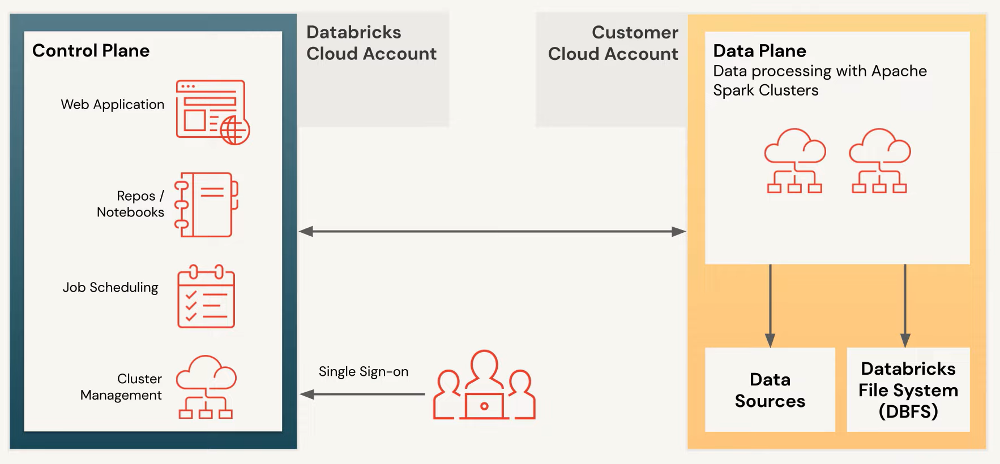

# What is the Databricks Lakehouse Platform

- Empowers everyone on a DS team to work on data from all phases from ingestion to modeling
- Databricks - Data + AI Company
  - Indentor and pioneer of data lakehouse
  - Delta Lake
  - Apache Spark
  - ML Flow
  - Koalas
  - redash
  - Over $3B investments
  - 3,000+ Employees globally
- Web-based interface
- Single platform
- Open-source format
  - Your data always belongs to you

## Partners

### Big Data and AI challenges

- Extracting insights from big data is complicated
  - Hard to manage
  - Volume, variety, velocity
  - Process batch and stream data
  - Use different data types in analysis (structured and unstructured)
  - Siloed, functional roles in DS teams
    - Data Scientist
    - Data Engineer
    - Data Analyst
    - Different versions
    - Security and governance issues

## Data Warehouses

### Strengths

- Purpose-built for BI and reporting
- Meant to unify disparate systems

### Downsides

- Poor support of unstructured data, data science, AI, and streaming
- Closed and proprietary formats
- Expensice to scale

## Data Lakes

### Strengths

- Store any kind of data
- Inexpensice storage
- Good starting point
- Any data in any format

### Downsides

- Complex to set up
- Poor BI performance
- Can become unreliable data swamps

## Data Lakehouses

- SImple
  - Unify data warehouseing and AI use cases on a single platform
- Open
  - Built on open source and open standards
- Milticloud
  - One consistent data platform across clouds
- Delta Lake
  - Data reliability and performance
- Benefits
  - ACID transactions
  - Schema enforcement
  - Governance support
  - Direct access to source data
  - Fully scalable
  - Storage decoupled from compute
  - Open formats
  - Structured, unstructured or semi-structured data
  - Real-time data collection and reporting

## Databricks Lakehouse Components

- Innovations
  - ACID Transactions
  - Indexing of unordered tables
  - Unity Catelog for governance
  - Expectations
- Data Engineering
  - Pipelines - raw data
  - Bronze - Silver - Gold

## ML Flow

## Collaboration

## Security

---

## Databricks SQL

- Databricks environment designed with SQL users in mind
- Query editor
- Use SQL commands for ad-hoc and exploratory analysis
- Build dashboards
- Can use BI tools - tableau / PowerBI / Looker / etc
- Drivers - routing service - query planning - query execution
- Working with Spark
  - Continue to write SQL
  - SQL Endpoint
    - Classical
    - Serverless
  - Data Catalog
  - Database
- Web interface
  - Queries
  - Dashboards
  - Alerts
  - Partner connect
    - Integrate other tools
  - Help
    - Documentation
    - Articles
    - Resources
  - Settings
    - Access tokens
    - Advanced details

### Querying Basics

- Query page
- Query Editor
  - List of existing queries
    - Filters
    - Tags
  - Create Query
  - Select SQL Endpoint from dropdown
  - Catalog in Schema browser
    - Database and table names
    - Details about table schema
  - Autocomplete and autoformatting options in query editor
  - Clone queries
  - Select a query
    - Past results
    - Visualizations
    - Refresh runs for current data
- Automate workflows
  - Set alerts
  - Refresh queries - scheduler
  - Search, threshold trigger, notifications
- Visualizations
  - Tied to specific queries
  - Drag and drop interface for many visualizations
- Partner connect
  - Tableau
  - Many others
  - Driver/token
  - 